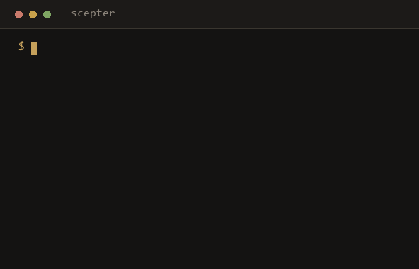

# Scepter

**Is this MCP server alive, maintained, and safe to use?**



More than half of published MCP servers are already dead, and only a fraction of the tens of thousands out there are actively maintained. Developers wire them into their AI agents without knowing which ones are abandoned, unmaintained, or risky. Scepter answers that question in one command.

```bash
npx scepter-mcp check owner/repo
```

## Install

```bash
# run without installing
npx scepter-mcp check <server>

# or install the command globally
npm install -g scepter-mcp
scepter check <server>
```

Requires Node 18 or newer. No runtime dependencies.

## Usage

Check one server, by GitHub repo or npm package:

```bash
scepter check owner/repo
scepter check https://github.com/owner/repo
scepter check some-mcp-server
scepter check @scope/name
```

Scan every server in an MCP config file:

```bash
scepter scan ./mcp.json
```

```
  HEALTHY  88  owner/weather-mcp
  CAUTION  61  another/mcp-thing
  RISKY    22  abandoned/old-mcp

  1 healthy   1 caution   1 risky
```

Options:

| Flag | Effect |
| --- | --- |
| `--github` | read the target as a GitHub repo |
| `--npm` | read the target as an npm package |
| `--json` | print JSON instead of a report |
| `-h, --help` | show help |

Set `GITHUB_TOKEN` in your environment to raise the GitHub API rate limit.

Exit code is `1` when the verdict is risky, so you can use Scepter in CI.

## Add a health badge to your README

```bash
scepter badge owner/repo
```

Prints a copy-paste Markdown badge:

```markdown
[](https://github.com/owner/repo)
```

## See what your agent actually calls

Static checks tell you if a server looks healthy. `wrap` tells you how it really
behaves. Put Scepter in front of the real server in your MCP client config:

```jsonc
{
  "mcpServers": {
    "weather": {
      "command": "npx",
      "args": ["-y", "scepter-mcp", "wrap", "--", "npx", "-y", "@scope/weather-mcp"]
    }
  }
}
```

Scepter forwards every byte unchanged, so your agent works exactly as before,
while recording each tool call, its result, timing, and any error locally under
`~/.scepter`. Then:

```bash
scepter report
```

```
  Recent MCP sessions   (2)

  SERVER                        CALLS   ERR    AVG    SLOW
  weather-mcp                      42     3    88ms   310ms
  files-mcp                        17     0    12ms    40ms

  Heads up
  - weather-mcp failed 3 of 42 calls (last: "upstream timeout"). Check it: scepter check weather-mcp
```

Nothing leaves your machine.

## What it checks (v1)

| Signal | Reads |
| --- | --- |
| **Activity** | last publish (npm) or last push (GitHub) |
| **Maintained** | archived flag, license, releases, link back to source |
| **Provenance** | stars, maintainers, open issues, description |
| **MCP fit** | whether it declares itself an MCP server |

These come from registry and repository metadata. That is enough to answer the headline question honestly: is this server dead or alive, and is it worth trusting?

## What it does not do (yet)

Scepter v1 does not run the server, complete a live MCP handshake, inspect the exact permissions it requests at runtime, or watch for unexpected network calls. Those are on the roadmap. Scepter never claims a server is "safe" or "undetectable", only what the metadata shows.

## Roadmap

- **v1** — health and trust check from metadata (`check`, `scan`, `badge`)
- **v2** — see which servers your agent actually calls, and their failures (`wrap`, `report`) *(this release)*
- **v3** — full traces, per-task cost, and replay, with the health check as one view

## License

MIT
